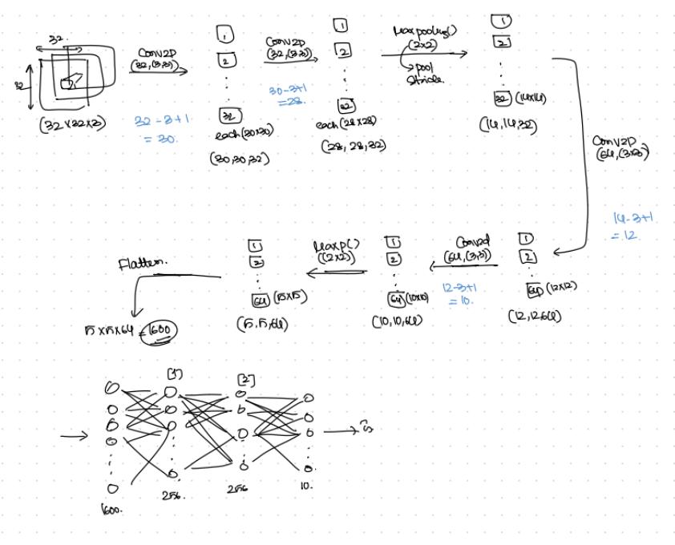

# understanding-neural-networks

Build a basic neural network using TensorFlow, with a focus on the underlying math. Trained on the MNIST dataset and achieves around 97% accuracy in digit classification

Rough sketch of the neural network I used:

Moved on to CNN, where I worked with the CIFAR-10 data, achieving an accuracy of about _ after experimenting with different layers and techniques.

Rough sketch of the CNN architecture I used:

