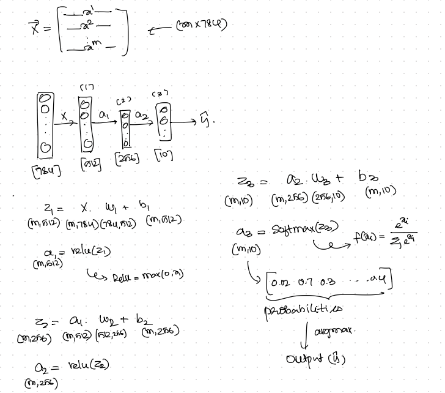

# understanding-neural-networks

Build a basic neural network using TensorFlow, with a focus on the underlying math. Trained on the MNIST dataset and achieves around 97% accuracy in digit classification

Rough sketch of the working behind the neural network:

